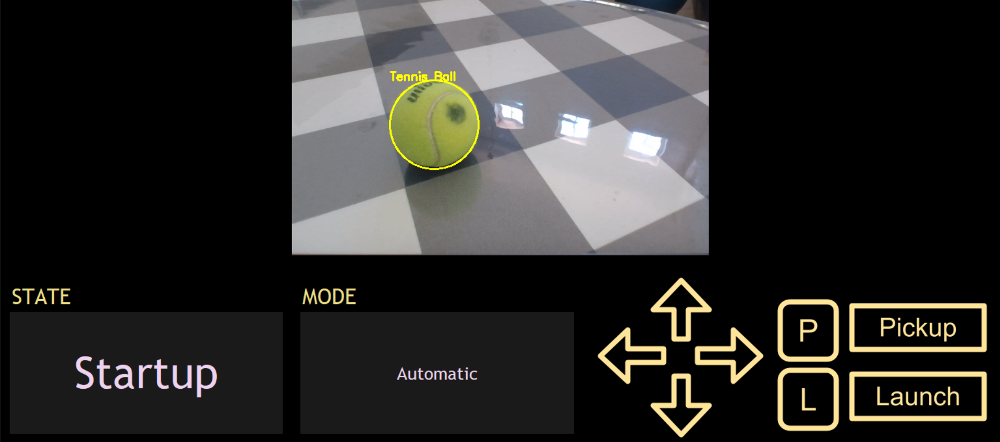

# "FetchBot" - Tennis Ball-Throwing Robot Arm
A robot arm powered by an ESP32 that detects tennis balls using computer vision and throws them. Designed for real-time object tracking, BLE control, and automated motion via servo actuation.

[Pickup Ball Example Video](https://www.youtube.com/watch?v=vLmMfNJC0tA)

Dashboard:

Robot arm:

